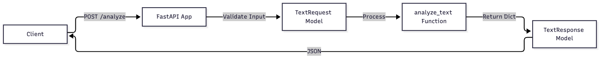
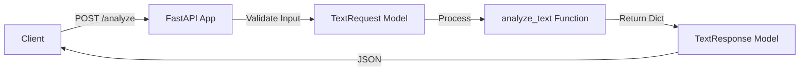

# Stellarchart

Identify potential exoplanet candidates from raw light curve data through natural language interaction.

# TextAnalyzer MVP

A simple FastAPI service to analyze text input.

## Usage

Run the server:
uvicorn main:app --reload

## API

POST /analyze
- Body: {"text": "string", "language": "string"}
- Returns: {"word_count": int, "char_count": int, "language": "string", "sentiment": "string"}

## Architecture

Mermaid source

